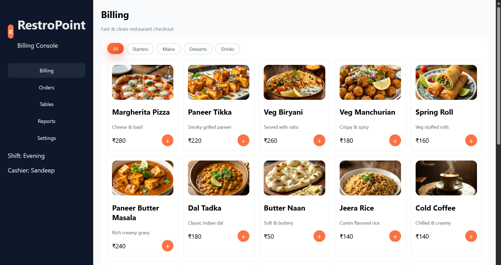

# 🍽️ Restaurant POS Billing System

A modern **Restaurant Billing / POS Web Application** built using  
**HTML, CSS, and JavaScript**.

## ✨ Features
- Interactive food menu with images
- Category filters (Starters, Mains, Desserts, Drinks)
- Add / remove items to bill
- Quantity control (+ / −)
- Automatic GST & Service Charge calculation
- Live total updates
- Customer name & phone input
- Print-ready bill
- Clean, professional UI (POS-style)

## 🛠️ Tech Stack
- HTML5
- CSS3 (Flexbox, Grid, Animations)
- Vanilla JavaScript

## 📸 Preview
> 

## 👤 Author
**Sandeep Kumar**  
GitHub: https://github.com/SandeepURO
